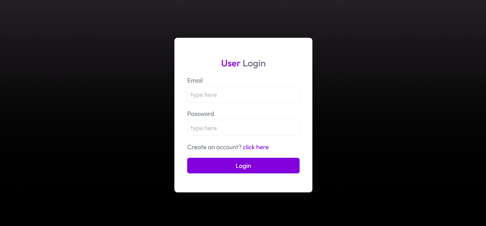
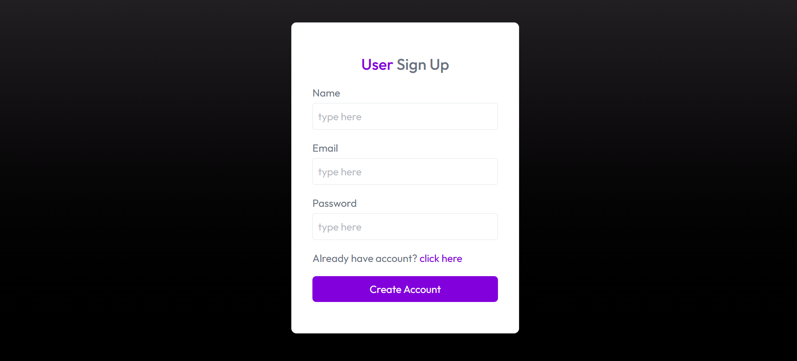
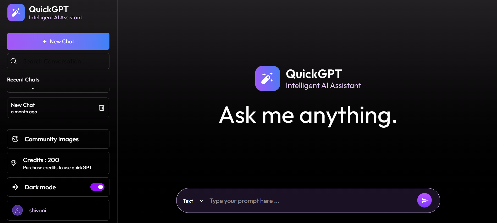
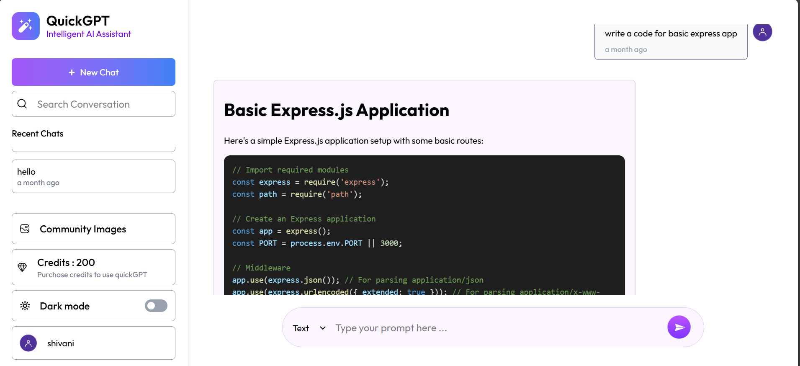
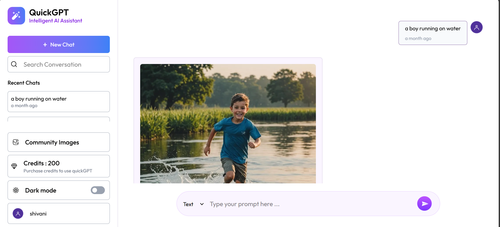
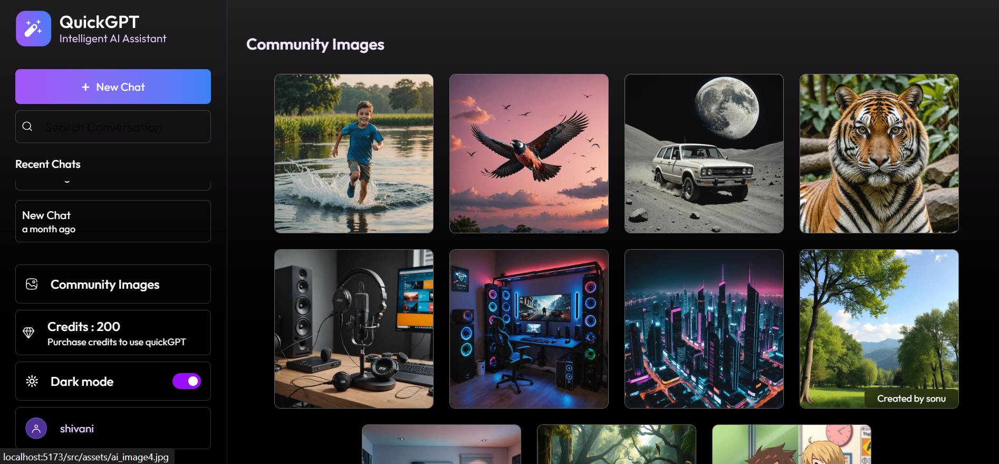
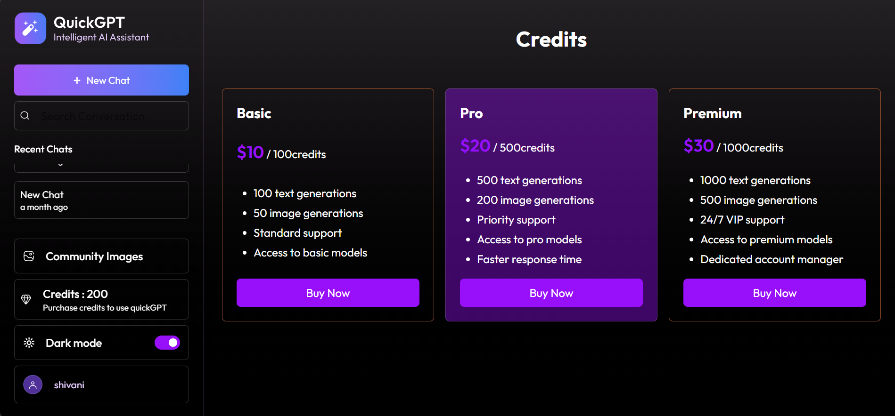

# QuickGPT 🚀

A **Full-Stack AI Chatbot Application** built with **React.js, Node.js, Express, MongoDB**, powered by **OpenAI / Gemini API**. QuickGPT lets you chat with AI (ChatGPT-style), talk to **Hitesh** or **Zakir** personas, generate images, manage credits, and explore a community gallery — all in a responsive interface.

---

## 🌟 Key Features

- **User Authentication:** Sign up & log in securely  
- **4-in-1 Chat Mode:** One dropdown — **Text (ChatGPT)** | **Image** | **Hitesh** | **Zakir**
- **Real-time AI Chat:** Text with general ChatGPT or persona-based (Hitesh Sir / Zakir)
- **AI Image Generation:** Create images from prompts (Image mode)
- **Credit System:** Credits for text (1) and image (2); purchase via Stripe
- **Community Gallery:** View and share AI-generated images
- **Theme Toggle:** Dark/Light mode
- **Responsive Design:** Mobile and desktop friendly
- **Deployed on Vercel:** Frontend & backend both on Vercel  

---

## 🎨 Preview










---

## 🛠️ Tech Stack

**Frontend:** React.js, Tailwind CSS, React Router, Moment.js  
**Backend:** Node.js, Express.js  
**Database:** MongoDB  
**AI Models:** OpenAI / Google Gemini API  
**Image Management:** ImageKit  
**Payments:** Stripe  
**Deployment:** Vercel  


## 🚀 Getting Started

### Prerequisites

- Node.js installed  
- npm or yarn  
- MongoDB account (Atlas) or local setup  
- Stripe API keys  
- OpenAI API credentials  
- ImageKit account  

### Setup

1. **Clone the repository**
```bash
git clone <your_repo_url>
cd <project_directory>
````

2. **Install dependencies**

```bash
# Frontend
cd client
npm install

# Backend
cd ../server
npm install
```

3. **Configure environment variables**

**Server `.env`** (in `server/` folder)

```env
MONGO_URI=your_mongodb_uri
OPENAI_API_KEY=your_openai_key
JWT_SECRET=your_jwt_secret
STRIPE_SECRET_KEY=your_stripe_secret
IMAGEKIT_PUBLIC_KEY=your_imagekit_publicKey
IMAGEKIT_PRIVATE_KEY=your_imagekit_privateKey
IMAGEKIT_URL_ENDPOINT=your_imagekit_endpoint
```

**Client `.env`** (in `client/` folder) — Vite uses `VITE_` prefix

```env
VITE_SERVER_URL=http://localhost:8000
```

4. **Start the development servers** (use two terminals)

```bash
# Terminal 1 — Backend
cd server
npm run server

# Terminal 2 — Frontend
cd client
npm run dev
```

5. **Access the app**  
   Open [http://localhost:5173](http://localhost:5173)

---

## 📝 Usage

1. **Sign up or log in**
2. **Choose mode** from the dropdown:
   - **Text (ChatGPT)** — General AI chat
   - **Image** — Generate images from prompts
   - **Hitesh** — Chat with Hitesh Sir persona
   - **Zakir** — Chat with Zakir persona
3. Type your message and send
4. Use **Community** to view shared images; **Credits** to buy more
5. Toggle **Dark/Light** theme; view or delete chat history from the sidebar

---

## 🌐 Deployment

- **Frontend:** Deploy `client/` to Vercel (build command: `npm run build`, output: `dist`)
- **Backend:** Deploy `server/` to Vercel (Node.js); ensure `vercel.json` and `server.js` export the app
- Set **VITE_SERVER_URL** in frontend env to your backend URL (e.g. `https://quick-gpt-backend-ten.vercel.app`)
- Live demo: [QuickGPT Frontend](https://quick-gpt-frontend-xi.vercel.app)

---

## 📄 License

This project is **open-source**. Fork, customize, and build your own AI chatbot!

---

## 📬 Contact

For queries or contributions, reach out via **shivanipandey0107@gmail.com**

---

**Made with ❤️ and AI magic!**

